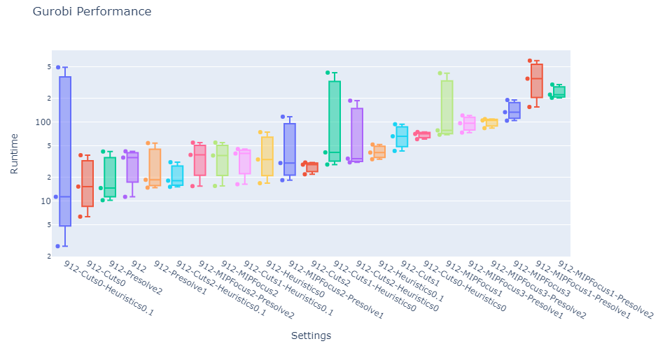

<p align="center">
	<a href="https://pypi.python.org/pypi/gurobi-logtools" alt="PyPI">
        </a>
    <a href="https://github.com/Gurobi/gurobi-logtools/blob/master/LICENSE" alt="License">
        </a>
    <a href="https://github.com/Gurobi/gurobi-logtools/actions/workflows/python-tox.yml" alt="Test Python Package">
        </a>
</p>

With **gurobi-logtools** you can extract information from Gurobi log files and generate [pandas DataFrames](https://pandas.pydata.org/) or Excel worksheets for further processing.  We also include a plot method which combines the power of interactive dashboards through [`ipywidgets`](https://ipywidgets.readthedocs.io/en/stable/) and plotting functions from [`plotly.express`](https://plotly.com/python/plotly-express/), making it easy to explore your data and results!

> [!NOTE]
> We have renamed the project to `gurobi-logtools`, so please also adapt the import statement accordingly:
>
> `import gurobi_logtools as glt`



# Installation

```
python -m pip install gurobi-logtools
```

It is recommended to prepend the `pip install` command with `python -m` to ensure that the package is installed using the correct Python version currently active in your environment.

See [CHANGELOG](https://github.com/Gurobi/gurobi-logtools/blob/master/CHANGELOG.md) for added, removed or fixed functionality.

# Usage and tutorial

First, you need a set of Gurobi log files to compare, e.g.,
  - results from several model instances
  - comparisons of different parameter settings
  - performance variability experiments involving multiple random seed runs
  - ...

For a description of the plotting dashboard please see the following link: [Gurobi-logtools plotting dashboard](Dashboard.md)

We provide a **TUTORIAL** in the form of a [gurobi-logtools.ipynb notebook](https://github.com/Gurobi/gurobi-logtools/blob/master/gurobi-logtools.ipynb) with the [example data set](https://github.com/Gurobi/gurobi-logtools/tree/master/data) to get started.
Additionally, there is a [Gurobi TechTalk demonstrating how to use it (YouTube)](https://youtu.be/wbg4Zr_A1s8), but please note it presents a version of gurobi-logtools that is several years old (but the big ideas remain the same):

[](https://youtu.be/wbg4Zr_A1s8)

## Pandas/Plotly
1. parse log files:
    ```Python
    import gurobi_logtools as glt

    results = glt.parse(["run1/*.log", "run2/*.log"])
    summary = results.summary()
    nodelog_progress = results.progress("nodelog")
    ```
    Depending on your requirements, you may need to filter or modify the resulting DataFrames.

2. draw interactive charts, preferably in a [Jupyter Notebook](https://jupyter.org/):

    - final results from the individual runs:
    ```Python
    glt.plot(summary)
    ```

    - progress charts for the individual runs:
    ```Python
    glt.plot(nodelog_progress, x="Time", y="Gap", color="Log", type="line")
    ```

    - progress of the norel heuristic (note, the time recorded here is since the start of norel, and does not include presolve + read time):
    ```Python
    glt.plot(results.progress("norel"), x="Time", y="Incumbent", color="Log", type="line")
    ```

    These are just examples using the [Plotly Python library](https://plotly.com/python/) - of course, any other plotting library of your choice can be used to work with these DataFrames.

## Other top-level functions

- **glt.register_custom_palette(name, colors)** : use this function to add custom palettes to the "Custom" group in the palette type field.  The arguments should be a string, and list/tuple of hex strings respectively.

- **glt.reset_custom_palettes()** : clears all custom palettes added

- **glt.show_palettes()** : displays a colorful guide to plotly's built-in palettes

- **glt.get_plotly_fig()** : use this function to access the underlying plotly figure.  You can use this figure object to perform detailed customizations via the `Figure.update_layout`, `Figure.update_traces`, `Figure.update_xaxes`, and `Figure.update_yaxes` functions.

- **glt.save_plot(filepath)** : use this function to save the plot to a range of formats including png, svg, pdf and html. The filetype is inferred from the extension of the filepath.  Note that additional packages may be needed to be installed depending on the filetype.

## Excel
Convert your log files to Excel worksheets right on the command-line:

```
python -m gurobi_logtools myrun.xlsx data/*.log
```

List all available options and how to use the command-line tool:

```
python -m gurobi_logtools --help
```

## Rename log files
The command line tool can also rename log files according to the parameters set and model solved in a given run. This is useful if your log files do not have a consistent naming scheme, or if multiple runs are logged per file and you want to extract the individual runs.

For example:

```
python -m gurobi_logtools --write-to-dir nicenames summary.xlsx tests/assets/combined/*.log
```

separates logs for individual runs in the input files and writes copies to the 'nicenames' folder with a consistent naming scheme.
