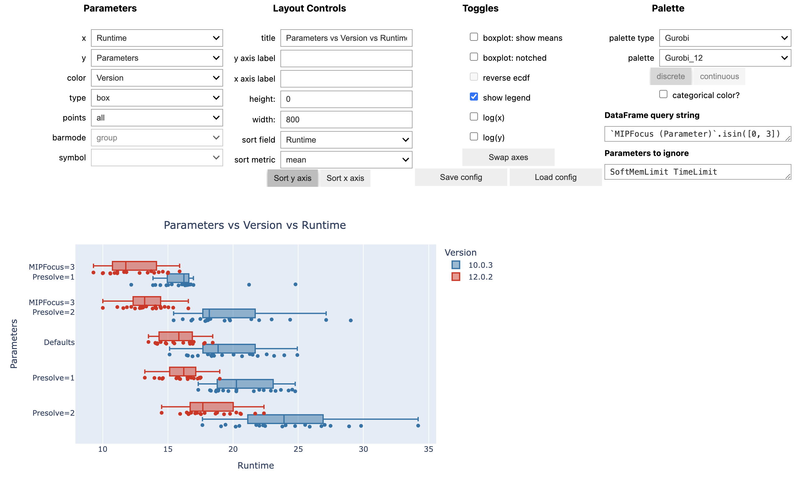

# GRBlogtools

Extract information from Gurobi log files and generate [pandas DataFrames](https://pandas.pydata.org/) or Excel worksheets for further processing. Also includes a wrapper for out-of-the-box interactive visualizations using the plotting library [Plotly](https://plotly.com/python/).




# Usage

First, you need a set of Gurobi log files to compare, e.g.,
  - results from several model instances
  - comparisons of different parameter settings
  - performance variability experiments involving multiple random seed runs
  - ...

## Pandas/Plotly
1. parse log files:
    ```
    import grblogtools as glt

    summary, timelines, rootlp = glt.get_dataframe(["run1/*.log", "run2/*.log"], timelines=True)
    ```
    Depending on your requirements, you may need to filter or modify the resulting DataFrames.

2. draw interactive charts, preferably in a [Jupyter Notebook](https://jupyter.org/):
    
    - final results from the individual runs:
    ```
    glt.plot(summary, x="Settings", y="Runtime", color="Seed", type="box")
    ```
    
    - progress charts for the individual runs:
    ```
    glt.plot(timelines, x="Timestamp", y="Gap", color="Log", type="line")
    ```

    These are just examples using the [Plotly Python library](https://plotly.com/python/) - of course, any other plotting library of your choice can be used to work with these DataFrames.

## Excel
Converting your log files to Excel worksheets works on the command-line:

```
python -m grblogtools myrun.xlsx data/*.log
```

This will show the available options and how to use the library:

```
python -m grblogtools --help
```
